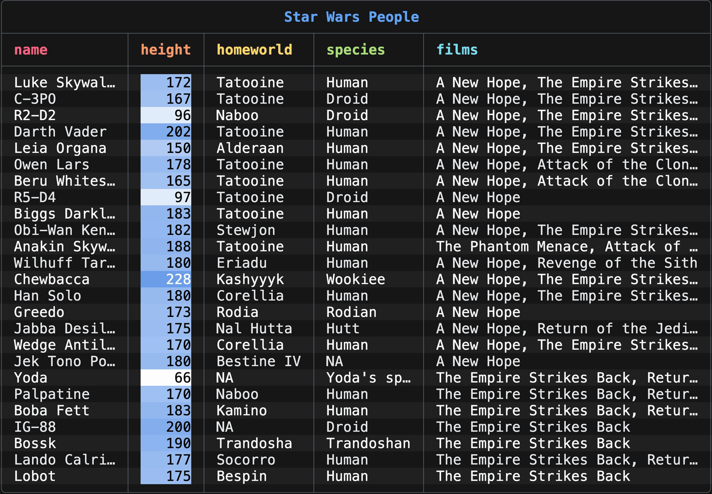
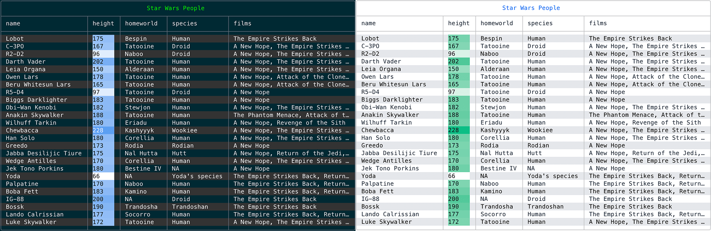
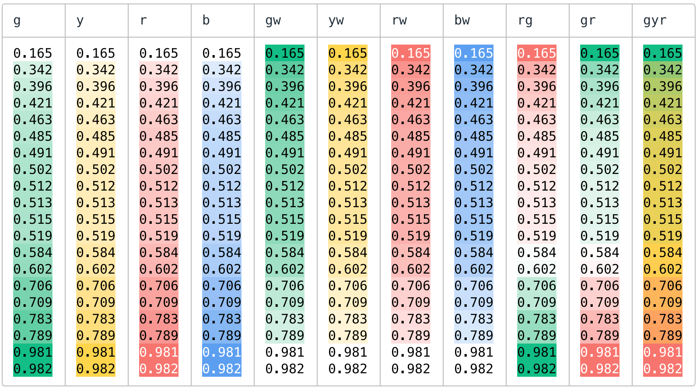
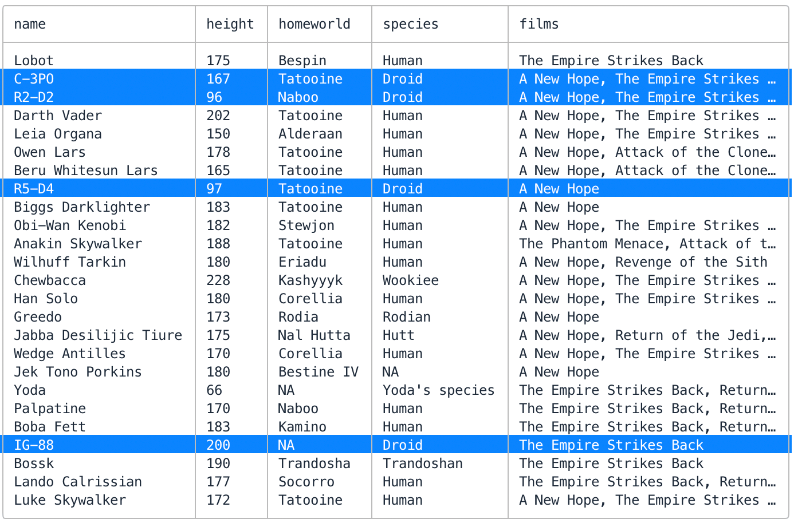
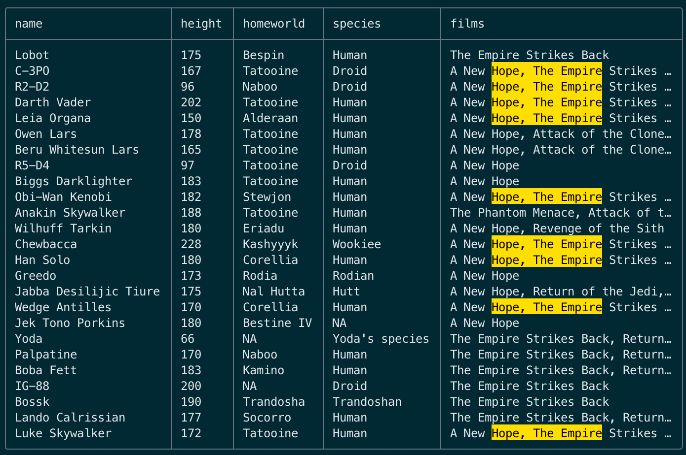
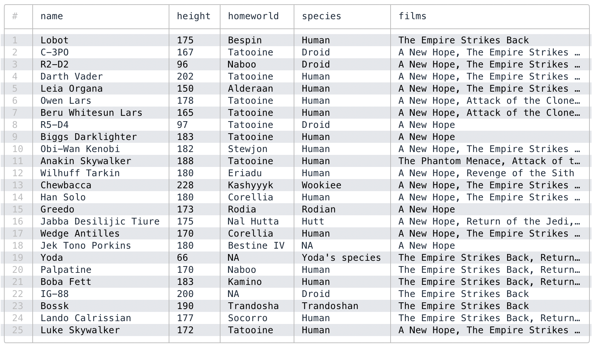
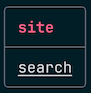

# TableTennis [](https://github.com/gurgeous/table_tennis/actions/workflows/test.yml)

TableTennis is a Ruby library for printing stylish tables in your terminal.

```rb
require "table_tennis"

options = { title: "Star Wars People", zebra: true, color_scale: :height }
puts TableTennis.new(Starwars.all, options)
```

Prints this lovely table in your terminal:



### Installation

```ruby
# install gem
$ gem install table_tennis

# or add to your Gemfile
gem "table_tennis"
```

### Important Features

- auto-themes to pick light or dark based on your terminal background
- auto-layout to fit your terminal window
- auto-format floats and dates
- auto-color numeric columns
- auto-link markdown links
- titles, row numbers, zebra stripes...

### Themes

TableTennis examines the background color of your terminal to pick either the dark or light theme. You can also specify `:dark` or `:light` manually, or even an `:ansi` theme to use your terminal's default colors. This feature is [surprisingly complicated](https://github.com/gurgeous/table_tennis/blob/main/lib/table_tennis/util/termbg.rb).



### Rows (Your Data)

Construct your table with an array of rows. Rows are hashes, ActiveRecord objects, structs, Data records, or anything that responds to `to_h`. It also supports oddballs like arrays (as rows) or even a single hash.

```ruby
puts TableTennis.new([{a: "hello", b: "world"}, {a: "foo", b: "bar"}])
puts TableTennis.new(Recipe.all.to_a)  # activerecord
puts TableTennis.new(array_of_structs) # these use to_h
puts TableTennis.new([[1,2],[3,4]])    # array of arrays
puts TableTennis.new(authors[0])       # single hash
```

### Big List of Options

Here is a more complex example to get you started:

```ruby
options = {
  color_scales: :commission,
  columns: %i[ name commission bday phone ],
  mark: -> { _1[:name] =~ /jane|john/i },
  row_numbers: true,
  save: "/tmp/people.csv",
  search: "february",
  title: "Employees",
  zebra: true,
}
```

#### Popular Options

| option         | default | details                                                                                                                                                                                                                         |
| -------------- | ------- | ------------------------------------------------------------------------------------------------------------------------------------------------------------------------------------------------------------------------------- |
| `color_scales` | ─       | Color code a column of floats, similar to the "conditional formatting" feature in Google Sheets. See [docs below](#color-scales).                                                                                               |
| `columns`      | ─       | Manually set which columns to include. Leave unset to show all columns.                                                                                                                                                         |
| `headers`      | ─       | Specify some or all column headers. For example, `{user_id: "Customer"}`. When unset, headers are inferred.                                                                                                                     |
| `mark`         | ─       | `mark` is a way to highlight specific columns with a nice color. For example, use `mark: ->(row) { row[:planet] == "tatooine" }` to highlight those rows. Your lambda can also return a specific bg color or Paint color array. |
| `row_numbers`  | `false` | Show row numbers in the table.                                                                                                                                                                                                  |
| `search`       | ─       | String/regex to highlight in output.                                                                                                                                                                                            |
| `separators`   | `true`  | Include column and header separators in output.                                                                                                                                                                                 |
| `title`        | ─       | Add a title line to the table.                                                                                                                                                                                                  |
| `titleize`     | ─       | Titleize column headers, so `person_id` becomes `Person`.                                                                                                                                                                       |
| `zebra`        | `false` | Turn on zebra stripes.                                                                                                                                                                                                          |

#### More Advanced Options

| option        | default | details                                                                                                                                                                                                                                                                     |
| ------------- | ------- | --------------------------------------------------------------------------------------------------------------------------------------------------------------------------------------------------------------------------------------------------------------------------- |
| `coerce`      | `true`  | if true, try to coerce strings into numbers where possible so we can format with `digits`. You may want to disable this if you already have nicely formatted ints/floats and you don't want TableTennis to mess with them.                                                  |
| `color`       | ─       | Are ANSI colors enabled? Specify `true` or `false`, or leave it as nil to autodetect. Autodetect will turn on color unless redirecting to a file. When using autodetect, you can force it on by setting `ENV["FORCE_COLOR"]`, or off with `ENV["NO_COLOR"]`.                |
| `delims`      | `true`  | Format ints & floats with comma delimiter, like 123,456.                                                                                                                                                                                                                    |
| `digits`      | `3`     | Format floats to this number of digits. TableTennis will look for either `Float` cells or string floats.                                                                                                                                                                    |
| `layout`      | `true`  | This controls column widths. Leave unset or use `true` for autolayout. Autolayout will shrink the table to fit inside the terminal. `false` turns off layout and columns will be full width. Use an int to fix all columns to a certain width, or a hash to just set a few. |
| `placeholder` | `"—"`   | Put this into empty cells.                                                                                                                                                                                                                                                  |
| `save`        | ─       | If you set this to a file path, TableTennis will save your table as a CSV file too. Useful if you want to do something else with the data.                                                                                                                                  |
| `strftime`    | see →   | strftime string for formatting Date/Time objects. The default is `"%Y-%m-%d"`, which looks like `2025-04-21`                                                                                                                                                                |
| `theme`       | ─       | When unset, will be autodetected based on terminal background color. If autodetect fails the theme defaults to :dark. You can also manually specify `:dark`, `:light` or `:ansi`. If colors are turned off this setting has no effect.                                      |

### Color Scales

Color scales are useful for visualizing numeric columns. The `:color_scales` option can be a single column, an array of column names, or a hash from column names to colors. The scale defaults to `:b` (blue) if you don't use a hash.

```ruby
puts TableTennis.new(rows, color_scales: :price)
puts TableTennis.new(rows, color_scales: [ :price, :quantity ])
puts TableTennis.new(rows, color_scales: { price: :b, quantity: :r })
```

The color names are abbreviations, so `:gyr` goes from green to yellow to red. Here is the full list of supported color scales - `%i[g y r b gw yw rw bw rg gr gyr]`. For clarity this screenshot uses sorted columns, but note that TableTennis never does any sorting:



### Tips

Use **mark** to highlight certain rows. Maybe you need to find the droids? Or **search** to highlight text. I almost always use **row numbers** and **zebra stripes** too.

```ruby
puts TableTennis.new(rows, mark: ->(row) { row[:homeworld] =~ /droids/i })
puts TableTennis.new(rows, search: /hope.*empire/i })
puts TableTennis.new(rows, row_numbers: true, zebra: true)
```

| `:mark`                             | `:search`                       | `:row_numbers` and `:zebra`                   |
| ----------------------------------- | ------------------------------- | --------------------------------------------- |
|  |  |  |

### Links

Modern terminals support **hyperlinks** in the text stream. If your table includes markdown-style links, TableTennis will use [OSC 8](https://github.com/Alhadis/OSC8-Adoption) to render them. For example:

```ruby
puts TableTennis.new([{site: "[search](https://google.com)"}])
```



### Advanced Usage

TableTennis can be configured a few different ways:

```ruby

TableTennis.defaults = { title: "All Tables Have This Name" }
TableTennis.new(rows, title: "An Amazing Title")
TableTennis.new do |t|
  t.title = "Yet Another Way To Set Things Up"
end
```

Tables usually get `puts` to $stdout, but there are other ways to do it:

```ruby
# Uses `to_s`, so there can be a pause before output shows up. Best for small tables.
puts TableTennis.new(rows)

# Write to `$stdout` one row at a time. Prefer this for tables over 10,000 rows.
TableTennis.new(rows).render

# Render to any I/O stream ($stdout/$stderr, an open file, StringIO...)
TableTennis.new(rows).render(io)
```

### Similar Tools

We love CSV tools and use them all the time! Here are a few that we rely on:

- [bat](https://github.com/sharkdp/bat) - syntax highlights csv files, and many others
- [csvlens](https://github.com/YS-L/csvlens) & [tidy viewer](https://github.com/alexhallam/tv) - great viewers for CSV files, beautiful and fun
- [qsv](https://github.com/dathere/qsv) - filter, sort, combine, join... (a fork of [xsv](https://github.com/BurntSushi/xsv))
- [Terminal::Table](https://github.com/tj/terminal-table) - wonderful rubygem for pretty printing tables, great for non-hash data like confusion matrices
- [visidata](https://www.visidata.org) - the best for poking around large files, it does everything

### Changelog

#### 0.0.7 (Aug '25)

- handle data that already contains ANSI colors (thx @ronaldtse, #12)
- don't crash if IO.console is nil (thx @ronaldtse, #14)

#### 0.0.6 (May '25)

- added `coerce:` option to disable string => numeric coercion
- added `headers:` option to manually set column headers
- fixed some issues related to links, including `save:`
- added MagicOptions

#### 0.0.5 (April '25)

- Support for markdown style links in the cells

#### 0.0.4 (April '25)

- Separators can be turned off with `separators: false`.
- Headers are in color now. Tweaked a few of the dark colors as well.
- Tricky math to better protect narrow columns with auto-layout.

### Special Thanks

- [termbg](https://github.com/dalance/termbg) and [termenv](https://github.com/muesli/termenv) for showing how to safely detect the terminal background color. These libraries are widely used for Rust/Go, but as far as I know nothing similar exists for Ruby.
- The [Paint gem](https://github.com/janlelis/paint) for help with ansi colors.
- I copied the header color themes from [tabiew](https://github.com/shshemi/tabiew). Great project!
- Google Sheets for providing nice color scales
